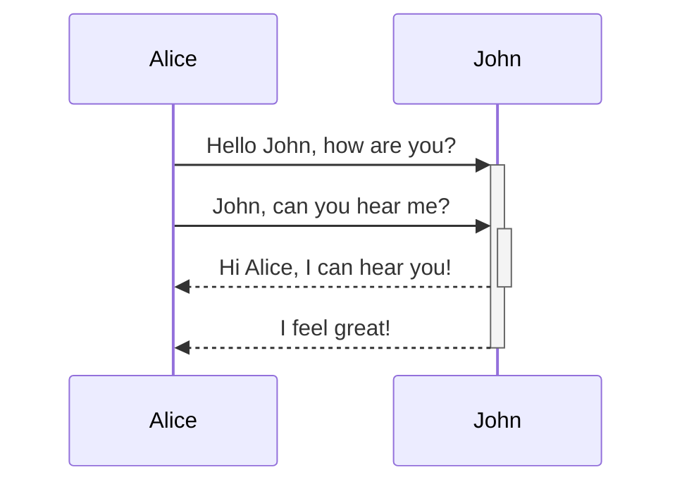
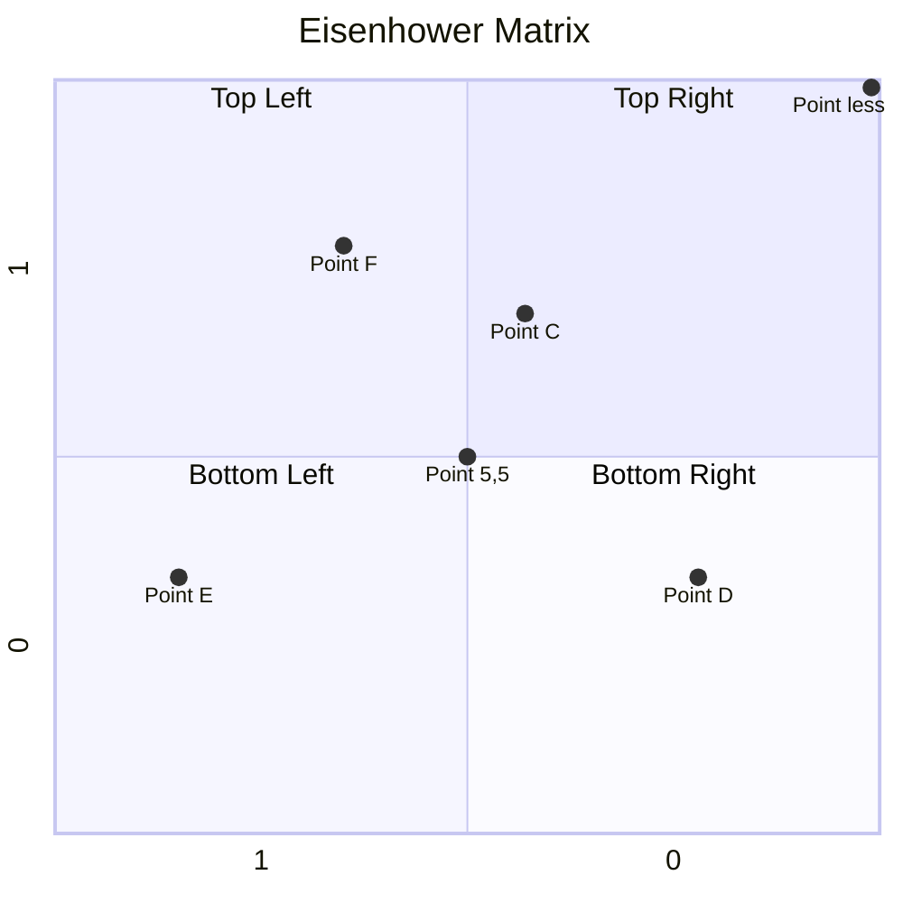

---
tags:
  - pkm/system
  - pkm/implementation
  - public
---
# Conchodial
Hi, I'm the first/new note that fractured [Obsidian](https://en.wikipedia.org/wiki/Obsidian). Whether you are just getting started in markdown or you are getting started using Obsidian, you can consider me a cheatsheet. Throw me in your vault and reference my weird name whenever you need me.

> [!tip] Learning the [Obsidian](https://obsidian.md) software
> General [help](https://help.obsidian.md/Home)
> [What they're all about](https://obsidian.md/about).
> Their [changelog](https://obsidian.md/changelog/)

[Nick Milo's Obsdian for Beginners Playlist](https://youtube.com/playlist?list=PL3NaIVgSlAVLHty1-NuvPa9V0b0UwbzBd) 
<iframe width="560" height="315" src="https://www.youtube.com/embed/videoseries?list=PL3NaIVgSlAVLHty1-NuvPa9V0b0UwbzBd" title="YouTube video player" frameborder="0" allow="accelerometer; autoplay; clipboard-write; encrypted-media; gyroscope; picture-in-picture" allowfullscreen></iframe>

Play around in the [Sandbox Vault](obsidian://open?vault=Obsidian%20Sandbox&file=Start%20Here) Included with your Software

Obsidian uses [Github Flavored Markdown Spec](https://github.github.com/gfm/#inline) OR https://help.obsidian.md/How+to/Format+your+notes
Things to Remember:
- The link: \[\[Conchoidal\]\]
- **The tag. Let's use #concepts or #a/breadcrumb/to/concepts**
- Italic -use *asterisks on each side* of the phrase you want.
- Bold - use double **asterisks on each side** of the phrase you want

## Formating in Obsidian
### Headers
This must be done at the begging of the line and their must be a space between `#` and the words comprising your header
# 1st Level is done with  \#1 hashtag 
## 2nd Level is done \## 2 hashtags
### 3rd Level is done \### 3 hashtags
#### 4th Level is done \##### 4 hastags
##### 5th Level is done with \##### hashtags
###### 6th Level is done with ###### hashtags

## Preview Pane
[Test](Disruption.md) ( between the brackets is the name of the link but between the greater/less-than signs is the name of the actual note)

### ~~Strikethroughs~~ & Highlights
You saw it 👆🏾and it will only be done in ==one color==

### Math
By default, Obsidian renders mathematical notation using [MathJax](https://docs.mathjax.org/en/latest/)

Simple: $e^{2i\pi} = 1$  or for subscripts `$_n$` will yield $_n$
Complex: $$\begin{vmatrix}a & b\\ c & d \end{vmatrix}=ad-bc$$
[Mathematical Notations in Obsidian Article](https://www.makeuseof.com/write-mathematical-notation-obsidian/)talks about using a LaTeX plugin to speed this up.
[Great Stack Exchange Tutorial Note](https://math.meta.stackexchange.com/questions/5020/mathjax-basic-tutorial-and-quick-reference) for some intermediary symbols.
[Cheatsheet for Latex Math Commands](https://tilburgsciencehub.com/topics/research-skills/templates-dynamic-content/templates/amsmath-latex-cheatsheet/#typeset)
### Code: Inline & Blocked
 IF you have a `single line of code` use single \` bacticks.
 IF you have ```
 multiple 
 lines
 of code```
...used 3\`\`\` backticks

### Linking

You can link to blocks within the note and create an alias
`[[filename#^sd9wde|what you want the link to read]]` [Src](https://help.obsidian.md/How+to/Link+to+blocks)

### Info Callout
> [!INFO]
> Callouts support **markdwon**, can be nested and have a whole bunch of [options](https://help.obsidian.md/How+to/Use+callouts):
> - !note
> >[!note]
> 
> - !abstract;  summary, tldr
> > [!abstract]
> - !todo
> > [!todo]
> - !tip; hint, important
> > [!tip]
> - !success; check, done
> > [!success]
> - !question; help, faq
> > [!question]
> - !warning; caution, attention
> > [!warning]
> - !failure; fall, missing
> > [!failure]
> - !danger; error
> > [!danger]
> - !bug
> > [!bug]
> - !example
> > [!example]
> - !quote
> > [!quote]

### Making References
A full reference link ([best src](https://www.markdownguide.org/basic-syntax/#reference-style-links)) is composed of two parts.

## Media
### Diagramming

[Mermaid Docs](http://mermaid.js.org/intro/) will show you how to do:
- [flow charts](https://mermaid.js.org/syntax/flowchart.html)
- sequence diagrams
- class diagrams
- state diagrams
- entity relationship diagrams
- user journey maps
- gantt charts
- pie charts
- [timelines](https://mermaid.js.org/syntax/timeline.html)
#### State Diagram




#### Quadrant



See [Mermaid Live Editor](https://mermaid-js.github.io/mermaid-live-editor/edit#pako:eNpVjstqw0AMRX9FaNVC_ANeFBq7zSbQQrPzZCFsOTMk80CWCcH2v3ccb1qtxD3nCk3Yxo6xxP4W760lUTjVJkCe96ay4gb1NJyhKN7mAyv4GPgxw_7lEGGwMSUXLq-bv18lqKbjqjGodeG6bKh69r8Cz1A3R0oa0_kvOd3jDB-N-7b5_H9ihXPrs-mp7KloSaAieSq4Q8_iyXX5_WlNDKplzwbLvHYkV4MmLNmjUePPI7RYqoy8wzF1pFw7ugj5LVx-AfLqVWg)


## Making Dynamic Pages

### Embedding

#### Adding in Pictures (images)
Drag and drop in or put in folder
Use `![[name of file]]` for internal files.
...and ``

See [src](https://help.obsidian.md/Editing+and+formatting/Basic+formatting+syntax).

#### Embed Youtube videos
``

#### Embeding notes into note (aka Transclusion)
\!\[\[note name\]\] will add the whole note
\!\[\[note name\^choose front pop up list\]\] when the items is include it will look like this `\![[note name#^9t9383]]`

#### a obsidian search query
This can be a good alternative to Dataview depending on the task and how sophisticated of a search query you can craft (i.e. can you regex if you need to?)
````
```query
embed OR search
```
````
([Search ref](https://help.obsidian.md/Plugins/Search))


---

### The 8 Most Important Settings in Obsidian
 - Editor: Spellcheck
 - Plugins: Tag Pane, Page Preview, 
 - File: Delete to System Trash / Automatically Update Internal Links
 - Appearance: Dark Mode / Custom CSS

### Creating Templates
**Enable the plugin:** [Settings](https://help.obsidian.md/How+to/Change+settings) > Core Plugins and enabling the “Templates” plugin.
Settings => Templates => "Template folder location" after enabling the plugin
[Obsidian's Template Help](https://help.obsidian.md/Plugins/Templates)

### Using Keyboard Shortcuts
https://keycombiner.com/collections/obsidian/ OR [Nick Milo's Post](https://forum.obsidian.md/t/obsidian-hotkeys-favorites-and-best-practices/12125)
- Navigate Back & Forth:  [alt] + [⌘] + [<] / [>]
- [Multiple cursors](https://help.obsidian.md/Editing+and+formatting/Multiple+cursors) [Shift]  [Option]
- To open a file [⌘] + [;] 

## Categories Needed to Address:
A blog addressing [what a PKM system is](http://www.thesweetsetup.com/pkm-intro-for-creatives/) noted the following components as a must.

| Component          | Solutions                                                                                                                             |
| :----------------- | :------------------------------------------------------------------------------------------------------------------------------------ |
| Note taking        | Obsidian is solving this however, syncing is the next friction area to address                                                        |
| Quick Capture      | [Chrome Extension - Obsidian Clipper](https://chrome.google.com/webstore/detail/obsidian-clipper/mphkdfmipddgfobjhphabphmpdckgfhb...) |
| Visual Thinking    | Muse for iPad, any integration? Excalidraw/Canvas                                                                                     |
| Read It Later      | Readwise Reader w/ [Official Readwise plugin](obsidian://show-plugin?id=readwise-official)                                            |
| Project Management | Trello or [Kanban plugin](https://github.com/mgmeyers/obsidian-kanban)?                                                               |
| Archive            | ?Open for discussion?                                                                                                                 |

### Task Tracking
- [ ] [Tasks](https://publish.obsidian.md/tasks/Introduction) are supported. There is also a 3rd party [Apple Reminders Plugin](https://github.com/urishiraval/obsidian-apple-reminders-plugin).

### Using Canvas
I find canvas great for brainstorming topics that I know I will build out. I also use it as a play to track complex topics that I'm integrating due to my attendance of a class or my reading of a book.
https://obsidian.md/canvas#protips


## Plugins to Consider
[Trello Integration](https://github.com/OfficerHalf/obsidian-trello).
[Incremental Writing](https://github.com/bjsi/incremental-writing) - a integration based on the Super Memo ideas.
[KaTeX](https://forum.obsidian.md/t/new-plugin-convert-katex-to-mathjax-e-g-copy-from-chatgpt-to-obsidian/93225) -> [Math Jax](https://www.mathjax.org) - [like markdown for math equations](https://medium.com/beyond-productivity/using-mathjax-in-obsidian-c57640af11ec)
[Juggl](https://juggl.io/Juggl) - see an MOC side by side with a Jggl Graph to mirror the way brain hemispheres work


## Development Resources (Advanced)
https://docs.obsidian.md/Home
Obsidian's internal database is a NoSQL Database IndexDB [^ref4]
REGX Search [Obsidian Basics: Search & Starred Search ](https://youtube.com/watch?v=mbPS3GXFFA4&si=SOlz9ARS_84SVY7S)

---
## References
[Obsidianidian for Beginners: Start HERE - How to Use the Obsidian...](https://youtu.be/QgbLb6QCK88)
[^ref1]: https://medium.com/geekculture/how-i-track-my-tasks-in-obsidian-47fd7ad80364 "How I TRack My Tasks In Obsidian"
[^ref2]: https://obsidian.md/plugins ''Obsidian Community Plugins"
[^ref3]: https://notes.linkingyourthinking.com/Umami/The+forest+entrance "PKM Guiding Values"
[^ref4]: https://forum.obsidian.md/t/understanding-obsidian-and-how-it-works/30603
Advanced: Access Developer Console ⌘ + ⌥ + I or

